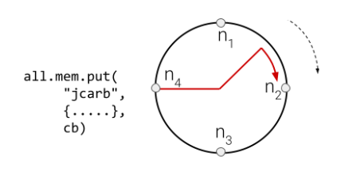

# M4: Distributed Storage

> Collaboration: Individual milestone
>
> Completion: About 10-12 hours (but might take longer if content is unfamiliar/new.)
>
> Deadline: Thursday Mar. 14, 2024 (11:59PM ET)
>
> Latest handout version: [CS1380:2024:M4](https://docs.google.com/document/d/e/2PACX-1vTaNApxwIVcprvSyNN8IQSePQDgG6joHzGu8IReYaPgPW3fKp9y19nQpU2NJ6uycePfrAe3XYuWu-9n/pub)
>
> GitHub repo: <https://github.com/brown-cs1380/m4>

The goal of this milestone is to implement a distributed and scalable storage subsystem over a set of nodes. Its core is a distributed key-value store centered around two classic techniques — consistent hashing and rendezvous hashing — to store, retrieve, update, and delete objects. An important benefit of these techniques is their ability to offer optimal reconfiguration overhead when a node is removed from a group or a new node is added to the group. This milestone builds on M3: given an object and a set of nodes in a group, your implementation should be able to pick a node responsible for storing that object.

## Table of Contents

  - [Background & Context](#background--context)
  - [The local mem and store interfaces](#the-local-mem-and-store-interfaces)
  - [The distributed mem and store interfaces](#the-distributed-mem-and-store-interfaces)
  - [Consistent & Rendez-Vous Hashing](#consistent--rendez-vous-hashing)
  - [Accessing all objects stored](#accessing-all-objects-stored)
  - [Storage Reconfiguration (Extra Credit & Capstone)](#storage-reconfiguration-extra-credit--capstone)
  - [Functionality Checklist](#functionality-checklist)
  - [Reflections & The Way Forward](#reflections--the-way-forward)
  - [Tips & Submission](#tips--submission)
  - [FAQ](#faq)
  - [Feedback](#feedback)

## Background & Context

To store (retrieve) data on (from) a distributed system, a node needs to be able to uniquely identify a node responsible for storing a datum. In theory, a few different approaches could address this. One approach would be to declare one node as a (somewhat centralized) coordinator and have it maintain a correspondence between nodes and objects: every time another node needs to store an object, it simply asks the coordinator for the node responsible for that object; and to retrieve that object, it would first consult the coordinator for the node responsible for that object. Unfortunately, this approach would not scale.

A better approach would be to ensure that, given an object and a set of nodes, the node storing or retrieving data can uniquely identify the node responsible for storing the data to — without consulting other nodes. To achieve this, the key idea is to divide data into partitions over the dimension of a “key” property whose values are unique for each object. Since the partitioning scheme depends only on a single key property, the structure of the rest of the object (i.e., its “secondary” properties) does not need to be known a priori nor does it need to remain fixed.

To manipulate storage, the `distribution` library offers local and distributed versions of two services — one in-memory store called `mem` and one persistent store called `store`.

Here are some relevant resources for this milestone:
- The built-in [fs module](https://nodejs.org/dist/latest-v20.x/docs/api/fs.html)

## The local mem and store interfaces

The `local` versions of these services provide node-local support for storing and retrieving objects by primary key. By node-local we mean that these services write to and retrieve from a structure that is internal to the node located serving the corresponding service operation.

| Service 	| Description                    	| Methods       	|
|---------	|--------------------------------	|---------------	|
| mem     	| An ephemeral (in-memory) store 	| get, put, del 	|
| store   	| A persistent store             	| get, put, del 	|

__Service__ `mem`. The `mem` service maintains a key-value map (hashmap) of names to objects and supports methods for inserting, retrieving, and deleting entries. If no primary key is provided to `put`, by passing the value `null` instead of a key, then the system uses the sha256 hash of the serialized object about to be stored as key.

```javascript
local.mem.put(user, "jcarb", (e, v) => {
  local.mem.get("jcarb", (e, v) => {
    local.mem.del("jcarb", console.log)
  });
});
```

If all went well, all three operations provide the target object (i.e., the object retrieved by a `get` operation, inserted by a `put` operation, or deleted by a `del` operation) as a value to the corresponding continuation. If an error occurred — for example, the value about to be accessed does not exist — the service should invoke the provided continuation with appropriate `Error` arguments (see [M2](https://docs.google.com/document/d/1JAZA-q0uTdeJV4aD2ewy9_ogphSKrd0WwXGBJauzxC4/edit#heading=h.xdn4ysl1soma)'s discussion of error handling)

The `get` and `put` operations are idempotent: invoking them with the same arguments multiple times has the same effect as invoking them once. Operation `del` returns an `Error` if it doesn't find an object. And `put`ing a new object with an existing key updates the corresponding value to the new value — i.e., there is no explicit `update` operation.

__Service__ `store`. The `store` service is identical to `mem`, except it stores objects _persistently on disk_ using the functionality of the standard `fs` module. The service can use the key as the filename (in a pre-specified directory), but it should protect against keys containing unsupported characters by converting keys to alphanumeric-only strings. It can also use the serialization/deserialization library to write values to disk as strings and read strings from disk as values. As with `mem`, in the absence of a key, the system should use the `sha256` hash of the serialized object as a key.

```javascript
local.store.put(user, "jcarb", (e, v) => {
  local.store.get("jcarb", (e, v) => {
    local.store.del("jcarb", console.log)
  });
});
```

If all went well, all three operations provide the target object as a value to the corresponding continuation. If an error occurred — for example, the value about to be accessed does not exist — the service should invoke the provided continuation with appropriate `Error` arguments. And like `mem`, all three operations except `del` are idempotent, and `put` is used for updates too.

## The distributed mem and store interfaces

The distributed versions of these services provide support for storing and retrieving objects across an entire node group by primary key. These distributed methods can be invoked from any node in the distributed system, using identical calls and arguments, to store and retrieve objects across the system.



These objects are distributed (partitioned, not replicated) across different nodes in a node group. Additionally, the system provides the ability to reconfigure the mapping from object identifiers to nodes, useful for when there are changes in the membership of the node group.

| Service 	| Description                    	| Methods       	|
|---------	|--------------------------------	|---------------	|
| mem     	| An ephemeral (in-memory) store 	| get, put, del, reconf 	|
| store   	| A persistent store             	| get, put, del, reconf 	|

__Services__ `mem` and `store`. The distributed versions of these services internally use a hashing technique—e.g., a modulo function—to decide which node is responsible for storing an object, based on its primary key, then issue a `local.comm.send` to invoke the corresponding local `mem` or `store` method on that node. Here's an example use — the interface is identical to the `local` version of those nodes:

```javascript
all.store.put("ah", {first: "Alyssa", last: "Hacker"}, console.log);
```

Internally, every service method converts the primary key to a key identifier (KID) by applying a `sha256` method on the primary key. NIDs and KIDs __must__ draw from the same identifier space to be comparable — so both of them should  be `sha256` values.

__Service instantiation.__ These two services can be configured to use a specific hashing algorithm to identify nodes in a group responsible for storing an object. The hashing technique is part of the service's configuration context, and is passed via a `config.hash` variable:

```javascript
let context = {};
let store = (config) => {
  context.gid = config.gid || "all"; // node group
  context.hash = config.hash || utils.naiveHash; // hash function
  return { get: () => {}, put: () => {}, del: () => {}, reconf: () => {} };
}
```

The available hash functions (additional ones explained below) can be implemented as _pure_ functions, and since they do not depend on external state, they can be stored in the `utils` module to be externally testable. They can take as arguments a list of NIDs and a KID and return a single node ID. Here's the example for a `naiveHash` method:

```javascript
utils.naiveHash = (kid, nids) => { nids.sort(); nids[utils.idToNum(kid) % nids.length] }
```

The method `utils.idToNum`, likely to be used by other hashing methods too, should take as input an ID (a `sha256` hash) and convert it to the corresponding integer. The `idToNum` method should take into account the fact that the hash string is encoded in base16.

In terms of service instantiation, note that the service instances corresponding to different groups should be able to distinguish internally between identical keys: if `all.mem.get("ah")` and `browncs.mem.get("ah")` end up resolving to the same node, the node should be able to distinguish between the two objects inserted using the `put` methods corresponding to each group. We will later augment local operations with additional metadata to achieve this.

__Note: The local and distributed interface of `groups.put` service should now be extended to allow additionally passing a configuration object for specifying contextual information — e.g., both the `gid` and the hash function that will be used for a group. These interfaces will accept as an argument both a string (like before) and a more complex object — for example, `{gid: "string", hash: utils.naiveHash}`.__

## Consistent & Rendez-Vous Hashing

The `naiveHash` function above picks a node based on modulo arithmetic. But, [as we saw in class](https://drive.google.com/file/d/1wvYgZOiqXKNYOHNJqW3F2AEA_ObsYsR9/view?usp=sharing), when using naive modulo hashing, a change in the number of nodes in the group—e.g., one of the nodes in the group goes down or a new node is added—causes _most_ of the objects to be relocated. More advanced hashing techniques such as consistent hashing or rendez-vous hashing minimize this cost considerably — in fact, they incur the minimum possible cost.

__Consistent hashing.__ The key idea behind consistent hashing is to (1) place all nodes of a group on a ring, (2) place the object ID on the same ring, and (3) pick the node ID immediately following the object ID.

In our setting, given a KID and a list of NIDs, `utils.consistentHash` needs to:
1. convert the KID and NIDs to a numerical representation and insert them into a new list,
2. sort the list (avoiding unnecessarily mutating the original list),
3. pick the element right after the one corresponding to KID,
4. convert the chosen element back into an ID and return it

__Rendez-vous hashing.__ The key idea behind rendez-vous hashing is to (1) construct combined values for all combinations of the object ID and all NIDs, (2) hash all of these values, and (3) pick the highest such value

In our setting, given a KID and a list of NIDs, `utils.rendezvousHash` needs to: 
1. create a new list by concatenating each NID with the KID (any concatenation order is correct, but the tests expect you to do `kid` + `nid`.)
2. hash these values (e.g., `sha256`) and then convert them to a numerical representation,
3. sort the resulting values and pick the maximum, and
4. convert the chosen element back into an ID and return it

## Accessing all objects stored

This section extends the `get` method with the ability to return the full list of _keys_ available to the store if no key is passed: when a `get` is called with a `null` key argument, `store` and `mem` provide that list to the callback. This is useful for when the storage system needs to automatically redistribute the set of objects it stores — for example, if a node goes offline or if a new node joins the system.

Computing the full set of objects is relatively simple for the `local` case: `mem` can return the keys of the internal set and `store` can return the keys of objects on disk.

Computing the full set of keys stored in the distributed store service requires maintaining additional information at the `local` level — at the very least, invocations of `local.mem` and `local.store` need to know (and maintain on the side) which distributed service instance sent an object. This is necessary because different instances might correspond to different configurations (e.g., different sets of nodes or different hashing algorithms) and thus the locations of these objects are not shareable (or interchangeable, without additional effort) among these instances. Consider the following `get` requests:

```javascript
browncs.mem.get("jcarb",(e, v) => {});
all.mem.get("jcarb",(e, v) => {});
```

Even if both of these end up being resolved on the same node—say, in both cases the hashing algorithm resolves `jcarb` to n3—the local version `mem` should be able to distinguish between the two objects stored on each node. And to achieve that, it needs to maintain some additional metadata on the side.

Knowing and maintaining which distributed service instance sent an object requires two important additions. First,  the distributed service methods must provide instance information as part of the request or the object — i.e., the `local.store` storage services need to know which distributed service the object is coming from. This also means extending the local interface to accept as an argument both a string and a more complex object of the form `{key: "string", gid: "GID"}`. Second, the `local` storage services need to maintain that information on the side, to be able to query it when needed. An additional benefit of the scheme is that there are no collisions between different objects with identical keys that reach different storage instances.

Following this scheme, the following should print an error — assuming there was no earlier `put` operation with key `jcarb` on `browncs`:

```javascript
all.mem.put(user, "jcarb", (e, v) => {
  browncs.mem.get("jcarb", console.log); // prints an error
});
```

These two operations might be using different hash functions and different node groups, but they still might end up resolving to the same node (as groups are non-disjoint sets). The node should be able to distinguish that the two `local` operations are coming from two different `mem` instances.

## Storage Reconfiguration (Extra Credit & Capstone)

The `reconf` method of `mem` and `store` allows reconfiguring the service instance when a group change is detected. Automatically redistributing the set of objects a storage system stores is important for when a node goes offline or if a new node joins the system. The `reconf` method also takes as an argument an object representing the previous state of the group. The caller of the method is responsible for providing that.

Leaving detection aside — i.e., the ability to detect the need for reconfiguration is out of scope for M4 — `reconf` takes the following sequence of steps:

1. It goes through the list of object keys available in the service instance; it achieves this using a `get` with a `null` key, as described earlier.
2. It identifies all the nodes that need to be relocated by calling the service-internal hash function for all object IDs twice: once using the old group and once using the new group. All objects for which the two results are not identical need to be relocated (N.b.: no objects need to be relocated from the _failed_ node — this will be handled via failure-tolerance techniques later in the semester).
3. For each key of an object that needs to be relocated, it issues a sequence of `get` and `del` on the source node and a `put` on the destination node. The IDs of these two nodes are the ones identified by step 2.

The design of `reconf` is crucial in that it _first_ identifies all the keys to be relocated and then _relocates_ individual objects — rather than fetching all objects immediately and then transferring them to their corresponding locations using a combination of `get`, `del`, and `put`. The implementation makes the decision of whether to move a certain object or keep it in the current location _solely_ on its key.

## Functionality Checklist
Here's a quick checklist of most of the functionality implemented in this milestone:

1. Implement the `put`, `get`, and `del` methods of the local `mem` service
2. Implement the `put`, `get`, and `del` methods of the local `store` service
3. Implement the `put`, `get`, and `del` methods of the distributed `mem` service
4. Implement `util.idToNum` and then move on to `util.naiveHash`
5. Implement `util.consistentHash` and `util.rendezvousHash`. 
6. Implement `put`, `get`, and `del` of the distributed `store` service
7. Implement the `reconf` methods of the distributed `mem` and `store` services

Remember to test frequently.

## Reflections & The Way Forward
As part of your submission add a small README.md markdown file with the following structure, along with answers to the following prompts:

```markdown
# M4: Distributed Storage
> Full name: `<first last>`
> Email:  `<email@brown.edu>`
> Username:  `cslogin`

## Summary
> Summarize your implementation, including key challenges you encountered

My implementation comprises `<number>` new software components, totaling `<number>` added lines of code over the previous implementation. Key challenges included `<1, 2, 3 + how you solved them>`.

## Correctness & Performance Characterization
> Describe how you characterized the correctness and performance of your implementation

*Correctness*: I wrote `<number>` tests; these tests take `<time>` to execute. 

*Performance*: Storing and retrieving 1000 5-property objects using a 3-node setup results in following average throughput and latency characteristics: `<avg. throughput>`obj/sec and `<avg. latency>` (ms/object) (Note: these objects were pre-generated in memory to avoid accounting for any performance overheads of generating these objects between experiments).

## Key Feature
> Why is the `reconf` method designed to first identify all the keys to be relocated and then relocate individual objects instead of fetching all the objects immediately and then pushing them to their corresponding locations?

## Time to Complete
> Roughly, how many hours did this milestone take you to complete?

Hours: `<time>`
```

## Tips & Submission
Here are some guidelines that might be helpful:
- Services such as `store` offer distributed storage capabilities that persist between node reboots. However, for tests to be reproducible, __your system needs to start from a predefined state.__ For that, make sure to __clear__ each of your node's local storage before running tests. This can be a simple `rm -rf ./store/*`.
- With complex systems, logging can be an invaluable debugging tool. __In distributed systems, when remote nodes cannot write to `stdout` you'll want to persist logs to a debugging file.__ You can use methods such as `fs.writeFileSync` (note the synchronous call, to make sure you don't introduce additional concurrency when debugging) to append a log file to the node-local directory so that logs from multiple nodes don't get mixed up.
- Make sure you study the provided test cases — their inputs and outputs usually offer significant insights into the expected implementation structure. And as usual, write additional tests to confirm that your implementation works as expected; try to test the limits of your implementation in your test.
- Execute `eslint` frequently, and use the `--fix` flag to correct some of the style errors automatically.

To create a submission, run `s/submit.sh` from the root folder of M4. This will create a `submission.zip` file which you will then upload to [Gradescope](https://www.gradescope.com/) (select "managed submission" and then upload your zip manually). The zip archive will contain a `javascript/src/main` folder inside which all the files tracked by git and found to be modified. Make sure to `git commit` any new files you have created before running the submit script; the `s/submit.sh` script will not include any untracked files in the submission.

You are allowed to submit as many times as you want up until the deadline; so _submit early and often_. For full grade, before submitting the final version of your code make sure that (1) all linters run without any errors, (2) the provided tests run without any errors, and (3) you have provided an additional five or more tests with your implementation.

## FAQ
Here we compiled a list of FAQs.

- how to distinguish different node groups
  - use `gid`
- `all.mem.get` with null keys
  - The correct bahavior in this case is to get all the keys stored in the group.

## Feedback 

Please let us know if you find any mistakes, inconsistencies, or confusing language in this or any other CS1380 document by (1) emailing [cs1380headtas@lists.brown.edu](cs1380headtas@lists.brown.edu), or (2)  filling out the [M4 anonymous feedback form](https://forms.gle/LMaZKmfjUbm5ZsNC7). In both cases, concrete ideas on how to improve things would be appreciated.
